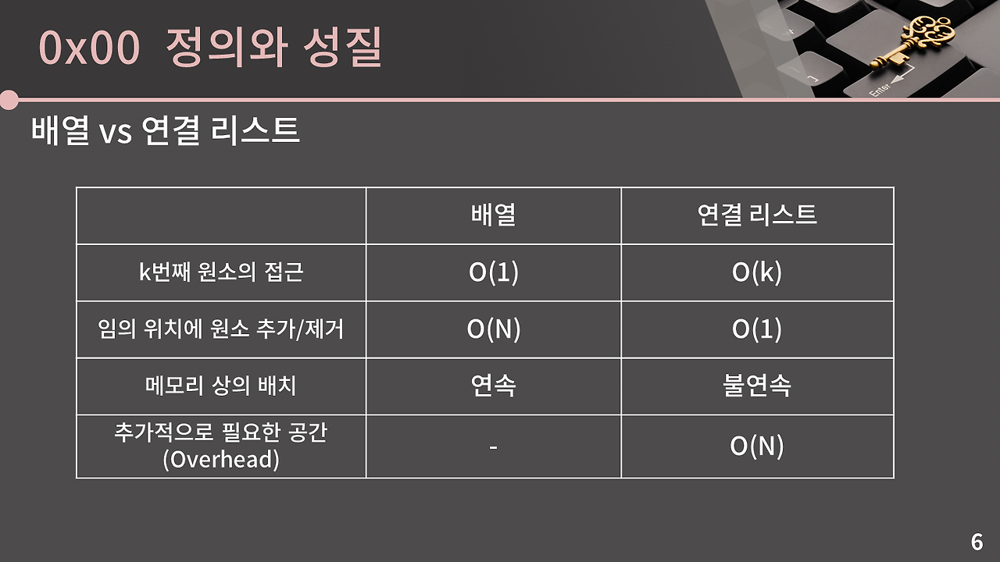

# 바킹독 알고리즘 풀이
## 0x04강 연결리스트
### 목표
- 3월 6일까지 3~8강 끝내기
- 각 연습문제를 30분 내로 풀기.
    - 틀려도 상관 없음. 일단 풀고 올리기

### 개념정리
- [바킹독 알고리즘 바로가기](https://blog.encrypted.gg/932)
- 정의와 성질
    - 연결리스트란? 원소들을 저장할 때 그 다음 원소가 있는 위치를 포함시키는 방식으로 저장하는 자료구조
    - k번째 원소를 확인/변경하려면 O(K)가 필요. 임의의 위치 원소 추가/제거는 O(1)
      - 단, 추가하고 싶은 위치를 알고 있을 때만 O(1)이고, 아닐 땐 추가하려는 곳까지 찾아간 뒤(O(k)) O(1)만에 추가한다고 보면 됨.
    - 메모리 상 불연속 된 공간에 할당해도 됨.
    - 종류 : 단일/이중/원형
    - 
### 애로사항
- C++
- Python